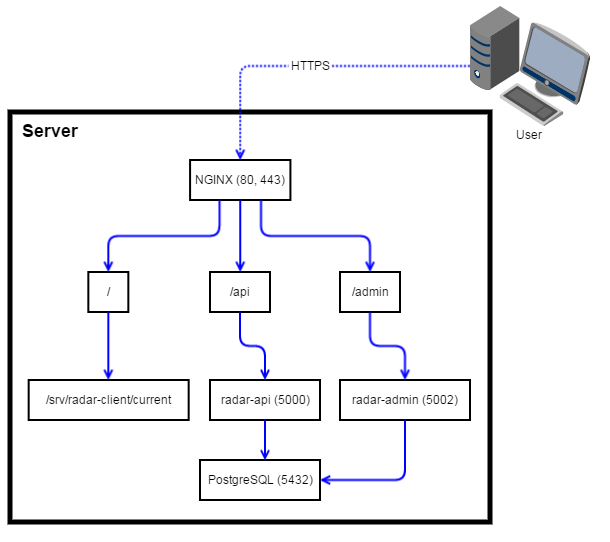
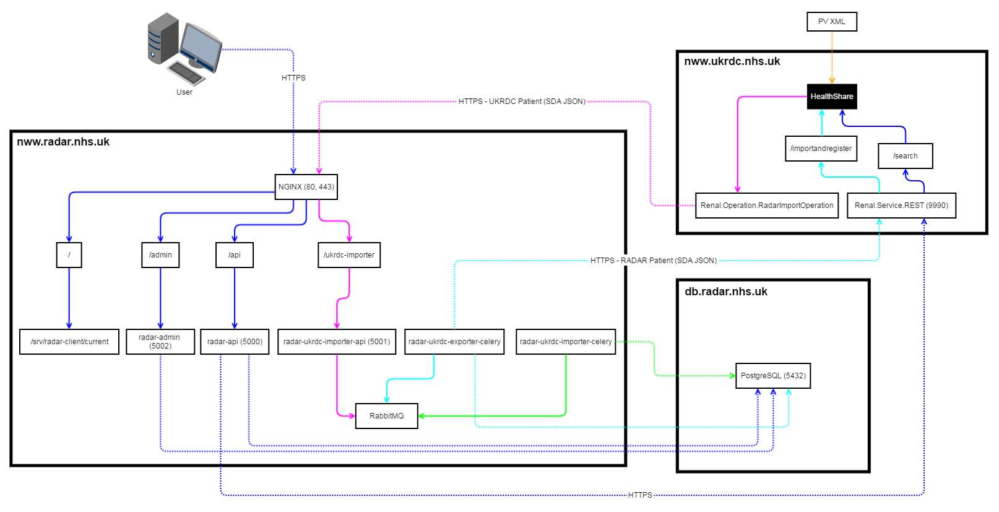

# RADAR

<center></center>

This repostitory is the home of the RADAR (Rare Disease Registry) backend.
The services include: the REST API (used by the [web interface](https://github.com/renalreg/radar-client)), the [UKRDC](https://github.com/renalreg/ukrdc) importer (receives data from the UKRDC), and the UKRDC exporter (sends data to the UKRDC).

## Build Status

[](https://travis-ci.org/renalreg/radar) [](https://codeclimate.com/github/renalreg/radar) [](https://coveralls.io/github/renalreg/radar)

## Getting Started

Optional: use [radar-ansible](https://github.com/renalreg/radar-ansible) to create a development VM.

Prerequisites:

* [Python 2.7](https://www.python.org/download/releases/2.7/), [pip](https://pypi.python.org/pypi/pip) and [virtualenv](https://pypi.python.org/pypi/virtualenv).
* [PostgreSQL 9.4+](https://www.postgresql.org/download/).

Create a user and database for RADAR to use:

```sql
CREATE USER radar WITH PASSWORD 'password';
CREATE DATABASE radar;
GRANT ALL PRIVILEGES ON DATABASE radar TO radar;
\c radar
CREATE EXTENSION "uuid-ossp";
```

Clone the repository:

```sh
git clone https://github.com/renalreg/radar.git
cd radar
```

Install the `radar` package and its dependencies:

```sh
virtualenv venv
. venv/bin/activate
pip install -r dev-requirements.txt
pip install -e .
```

Create a settings file:

```sh
cp example_settings.py settings.py
```

Create some test data:

```sh
RADAR_SETTINGS=/path/to/settings.py radar-fixtures all
```

Start the API:

```sh
RADAR_SETTINGS=/path/to/settings.py radar-api
```

## Overview

### Basic Configuration



### UKRR Configuration



## Test

With tox:

```sh
tox
```

Or using `py.test` directly:

```sh
py.test tests
```

## Build

Before releasing a new build increment the version number in `radar/__init__.py` and `git tag` the commit.
Only change the version number and deploy to production from the `master` branch.

### Local

Install [platter](https://github.com/mitsuhiko/platter):

```sh
virtualenv venv
. venv/bin/activate
pip install git+https://github.com/mitsuhiko/platter
```

Build:

```sh
platter build -r requirements.txt .
```

This will create a `.tar.gz` file in the `dist` folder.


### Remote

A remote build is useful when you are developing on a different operating system to the one you want to deploy to.

Install dependencies on the remote machine:

```sh
yum install https://download.postgresql.org/pub/repos/yum/9.4/redhat/rhel-7-x86_64/pgdg-centos94-9.4-2.noarch.rpm
yum install postgresql94 postgresql94-libs postgresql94-devel

wget https://bootstrap.pypa.io/get-pip.py
python get-pip.py

pip install git+https://github.com/mitsuhiko/platter
```

Build:

```sh
fab -H $HOSTNAME -u $USER build
```

The built `.tar.gz` will be downloaded into the `dist` folder on the local machine.

## Deploy

You'll need to create the `/srv/radar` folder if it doesn't exist:

```sh
ssh nww.radar.nhs.uk mkdir -p /srv/radar
```

Each deployed version is kept in its own folder in `/srv/radar`, for example `/srv/radar/1.0.0` and `/srv/radar/2.0.0`. The `/srv/radar/current` symlink points to the latest version of the code.

Deploy the latest build (`.tar.gz` in `dist`) and reload/restart the services:

```sh
fab -H nww.radar.nhs.uk -u root deploy
```

Deploy to multiple servers by separating their hostnames with commas. The `--gateway` option is useful for tunneling through another server.

### Downgrading

For example if you have deployed version `2.0.0` but need to downgrade to version `1.0.0`.

If `/srv/radar/1.0.0` exists you can simply:

```sh
ln -sfn /srv/radar/1.0.0 /srv/radar/current
systemctl reload radar-api
```

If you still have the `.tar.gz` file locally:

```sh
fab -H nww.radar.nhs.uk -u root deploy:archive=dist/radar-1.0.0-linux-x86_64.tar.gz
```

Otherwise you'll need to rebuild the `.tar.gz`:

```sh
git checkout tags/v1.0.0
platter build -r requirements.txt .
fab -H nww.radar.nhs.uk -u root deploy:archive=dist/radar-1.0.0-linux-x86_64.tar.gz
```

## License

Copyright (c) 2016 UK Renal Registry.

Licensed under the [AGPL](LICENSE.md) license.
